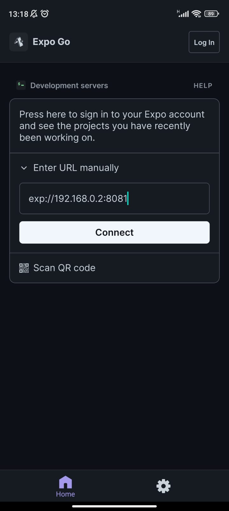

# WaiterApp Mobile

<p align="center">
  
</p>

WaiterApp, o App do Garçom, descarta a necessidade de comandas físicas em restaurantes e bares. O aplicativo permite que o garçom realize pedidos e os envie diretamente para a cozinha, onde haverá um painel para acompanhar e atualizar os pedidos.

O aplicativo traz consigo, pelo menos, 3 vantagens:
1. **Organização dos pedidos**: como o aplicativo descarta a necessidade de papel, preocupações com disponibilidade de espaço e estoque de comandas não existem. Além disso, o aplicativo já organiza os pedidos em ordem de chegada.
2. **Agilidade**: sem a necessidade de anotar o pedido à mão e ir até a cozinha, o tempo que o garçom gasta realizando um pedido é menor.
3. **Redução de erros**: evita erros ao anotar os pedidos, perda de comanda, ordenação errada dos pedidos, entre outros.

Este é o repositório do aplicativo mobile, que fica com o garçom. O repositório da aplicação web, que fica na cozinha, pode ser acessado [aqui](https://github.com/nataelienai/waiterapp-web).

Este projeto foi desenvolvido durante o curso [JStack](https://jstack.com.br/).

## Tecnologias

- Linguagem: TypeScript
- Gerenciador de pacotes: Yarn
- Bibliotecas: React Native, Expo, Styled Components, Axios e Intl.js
- Ferramentas: ESLint, Prettier, EditorConfig, commitlint, lint-staged, husky, Git e Figma

## Dependências

Antes de tudo, é necessário estar com a [API](https://github.com/nataelienai/waiterapp-api) do projeto já em execução para que esta aplicação funcione.

Para executar esta aplicação, você precisará de [Git](https://git-scm.com/downloads) e [Node.js](https://nodejs.org/) instalados no seu computador e [Expo Go](https://expo.dev/expo-go) instalado no seu celular.

## Como executar

1. Abra um terminal e clone o repositório:
```sh
git clone https://github.com/nataelienai/waiterapp-mobile.git
```

2. Entre na pasta do repositório clonado:
```sh
cd waiterapp-mobile
```

3. Instale o Yarn (caso não o tenha):
```sh
npm install -g yarn
```

4. Instale as dependências do projeto:
```sh
yarn
```

5. Inicialize a aplicação:
```sh
yarn start
```

Após isso, aparecerá a mensagem `Metro waiting on exp://<IP>:8081`, onde `<IP>` é o endereço IP do seu computador na sua rede local.

6. Acesse o arquivo `src/env.ts` e substitua o endereço IP presente no arquivo pelo endereço IP do seu computador na sua rede local:
```ts
export const env = {
  baseUrl: 'http://<Insira o seu endereço IP aqui>:3001',
};
```

Isso é necessário para que o aplicativo consiga se comunicar com a API.

7. Por fim, copie o endereço presente na mensagem `Metro waiting on <endereço>`, abra o aplicativo Expo Go no seu celular, insira o endereço nele e clique em `Connect`:

<p align="center">
  
</p>
